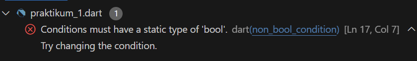
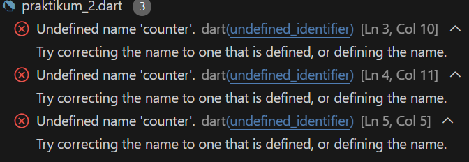
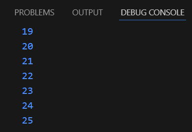
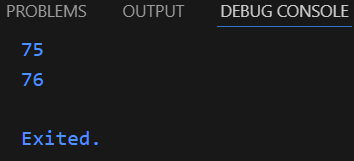
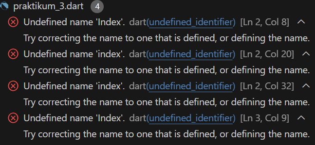
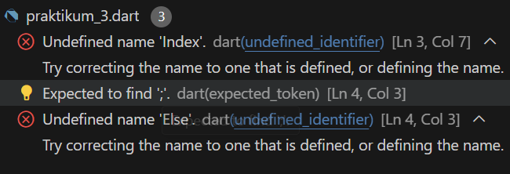

# Praktikum 1
Langkah 1 <br>
``` dart
  String test = "test2";
  if (test == "test") {
    print("Test1");
  } else if (test == "test2") {
    print("Test2");
  } else {
    print("Something else");
  }
  if (test == "test2") print("Test2 again");

```
## Langkah 2 - Eksekusi Code dan Deskripsinya
Hasilnya adalah sebagai berikut
``` batch
  Test2
  Test2 again
``` 

Penjelasan: <br>
Pada kode yang sebelumnya dieksekusi terdapat variabel test yang bertipe data string yang memiliki value yaitu "test2". Kemudian ada if/else yang mengecek apakah variabel test memiliki nilai sama dengan "test1", karena nilainya tidak sama maka masuk pada if selanjutnya yang mengecek apakah variabel test nilainya sama dengan "test2". karena variabel test memiliki nilai yang sama maka akan dilakukan print("Test2"). Untuk hasil print yang Test2 again merupakan bentuk if else yang berbeda yang dapat dilakukan dengan cara memberikan perintah setelah pengecekan variabel

## Langkah 3 - Eksekusi Code dan Deskripsinya
``` dart
String test = "true";
if (test){
  print("Kebenaran");
}
```
Setelah eksekusi kode

Kode error karena variabel test adalah variabel string sedangkan pengecekan pada kode tersebut untuk tipe data boolean. <br>

Perbaikan Kode
``` dart
  String test = "true";
  if (test == "true") {
    print("Kebenaran");
  }
  // atau
  bool test = true;
  if (test) {
    print("Kebenaran");
  }
```

# Praktikum 2
## Langkah 1
``` dart
while (counter < 33) {
    print(counter);
    counter++;
  }
```
## Langkah 2

Setelah dilakukan eksekusi kode terdapat error karena variabel counter belum didefinisikan <br>
Perbaikan Kode:
```dart
  int counter = 75;
  while (counter < 33) {
    print(counter);
    counter++;
  }
``` 

Hasil Eksekusi : <br>

## Langkah 3
Tidak terjadi error karena variabel counter telah didefinisikan<br>
```dart
void main() {
  // Langkah 1
  int counter = 75;
  // while (counter < 33) {
  //   print(counter);
  //   counter++;
  // }
  do {
    print(counter);
    counter++;
  } while (counter < 77);
}

```
Hasil Kode : <br>

```dart


# Praktikum 3
## Langkah 1
```dart
void main (){
  for (Index = 10; index < 27; index){
  print(Index);
  }
}
```
## Langkah 2
Hasil eksekusi
 <br>
kode program error karena Index dan index belum terdefinisikan <br>
Perbaikan Kode:
```dart
void main (){
  for (int index = 10; index < 27; index){
  print(index);
  }
}
```
## Langkah 3
```dart
void main (){
  for (int index = 10; index < 27; index){
  if (Index == 21) break;
  Else if (index > 1 || index < 7) continue;
  print(index);
  }
}
```
Kode program error karena nama Index berlum terdefinisikan
 <br>
Perbaikan Kode : <br>
```dart
void main (){
  for (int index = 10; index < 27; index++){
  print(index);
  if (index == 21) break;
  else if (index > 1 || index < 7) continue;
  }
}
```
<br>
Hasil Kode : <br>

``` batch
10
11
12
13
14
15
16
17
18
19
20
21
```
