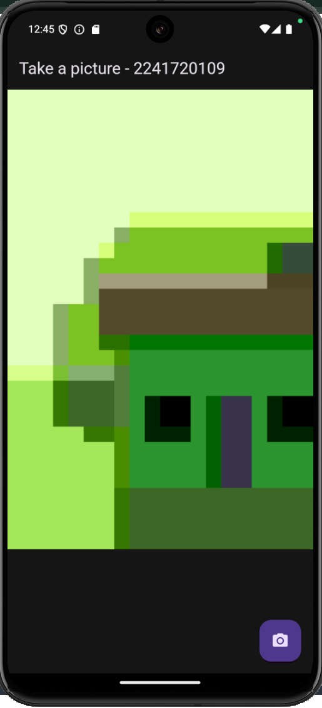
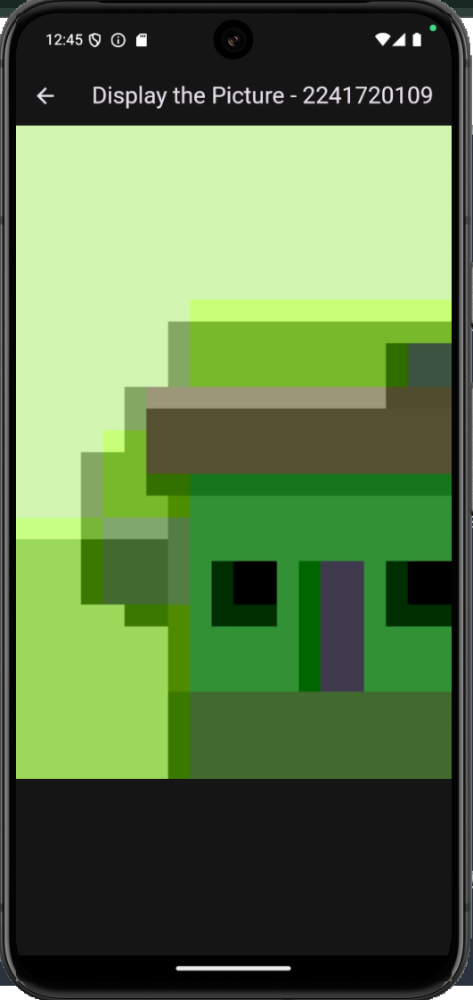
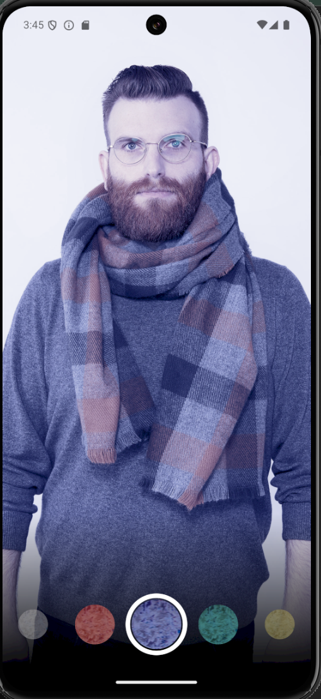
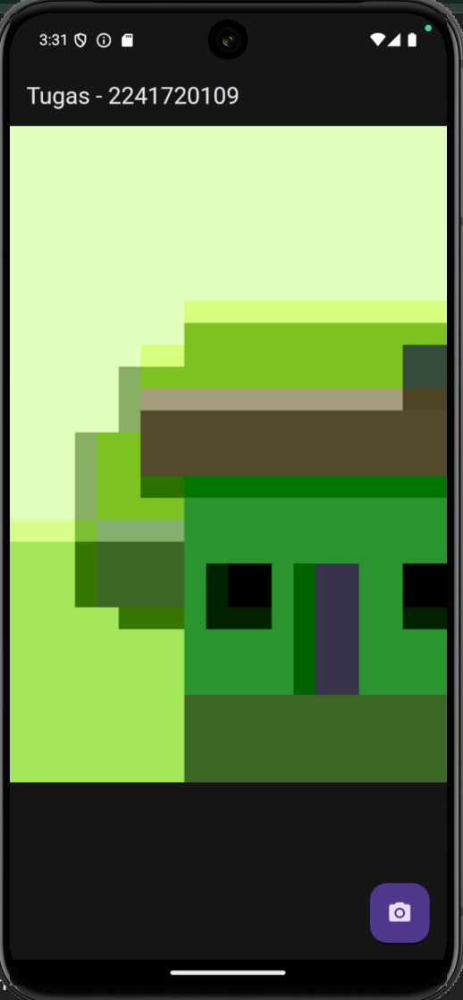
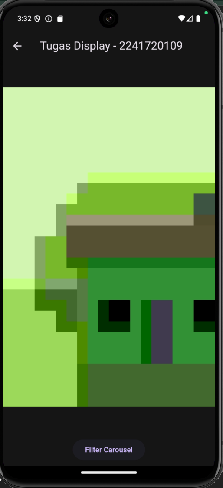
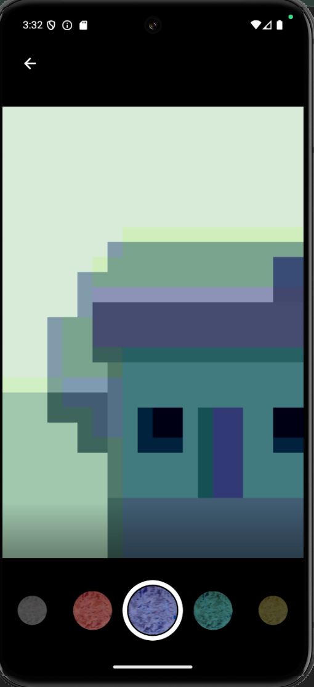

# Praktikum 1
## Hasil Praktikum 1
Pada praktikum 1 ini dilakukan untuk menangkap gambar dari kamera yang ada di android emulator. Jika tombol kamera ditekan maka akan menampilkan gambarnya di tampilan display picture.
- Take Picture  

- Display Picture  

# Praktikum 2
Pada praktikum 2 ini dilakukan untuk memberikan filter dari gambar yang kita ambil melalui image.network. Pada bagian bawah terdapat filter yang dapat kita scroll kesamping untuk memilih filter yang cocok.  

# Tugas Praktikum
Pada tugas praktikum, dilakukan penggabungan kode dari praktikum satu dan praktikum 2. Sehingga yang semula pada praktikum 2 pengambilan gambarnya menggunakan image.network pada tugas praktikum ini menggunakan pengambilan gambar melalui kamera android emulator. Setelah tombol kamera ditekan makan akan ditampilkan hasil gambar di tampilan display picture. Pada tampilan display picture ada sebuah tombol untuk mengaplikasikan filter pada gambar yang sudah ditangkap.
- Take Picture  

- Display Picture  

- Filter Carousel  

