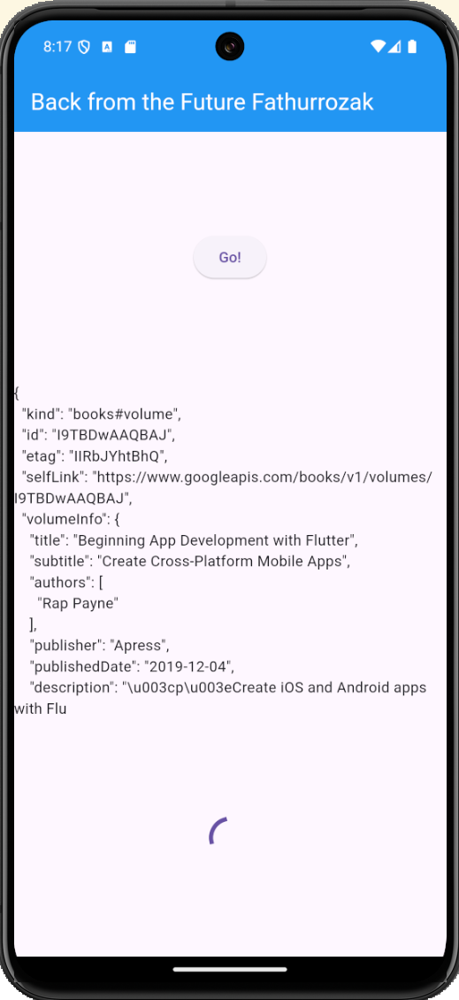
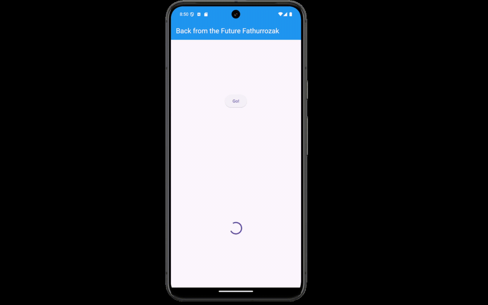
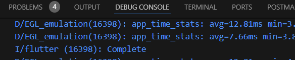

# Soal 1 & 2

# Soal 3

# Soal 4

# Soal 5
pada kode tersebut menggunakan Completer untuk mengelola operasi async. Fungsi getNumber digunakan untuk menginisialisasi Completer, memanggil fungsi calculate, dan mengembalikan Future yang akan diselesaikan oleh calculate setelah penundaan 5 detik kemudian akan selesai dengan menampilkan nilai 42.

# Soal 6
Kode langkah 5-6 memiliki penanganan error sedangkan kode langkah 2 tidak.

# Soal 7

# Soal 8
- Kode langkah 1 menggunakan FutureGroup dari package async sedangkan kode langkah 4 menggunakan Future.wait dari bawaan Dart.
- Kode langkah 1 menambahkan future satu-satu ke dalam FutureGroup sedangkan kode langkah 4 langsung membuat daftar Future di dalam Future.wait
Sehingga kode langkah 4 lebih sederhana dan lebih mudah dibaca sedangkan kode langkah 1 lebih coock digunakan ketika perlu menambahkan Future secara dinamis.

# Soal 9

