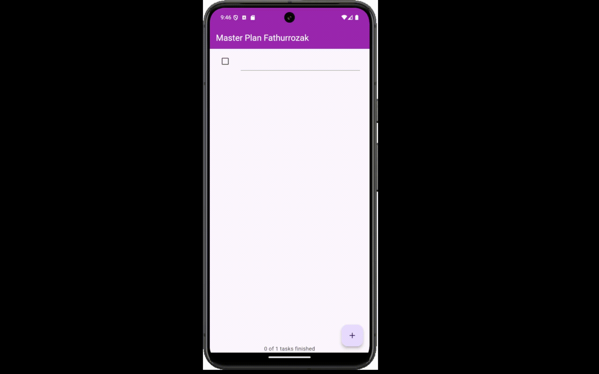

# Tugas Praktikum 1 - Dasar State dengan Model-View
## 1. Hasil Praktikum 

## 2. Penjelasan langkah 4

Agar lebih ringkas untuk import modelnya, sehingga jika memiliki model lebih dari satu maka tidak perlu mengimport satu persatu model yang dimiliki

## 3. Mengapa perlu variabel plan di langkah 6 pada praktikum tersebut? Mengapa dibuat konstanta

Karena variabel plan nantinya akan diisi dengan value yang berisi tugas dan menggunakan const karena untuk menyimpan value yang tidak berubah selama program dieksekusi atau valuenya tetap.

## 4. Hasil langkah 9

Pada Langkah 9 ini membuat kode untuk menampilkan dan mengelola task yang ada di daftar plan. status task yang ditampilkan dalam list dapat diubah selesai atau tidaknya dengan menekan checkbox 

## 5. Kegunaan method langkah 11 & 13 dalam lifecycle state
- Method initState pada langkah 11 digunakan untuk inisialisasi scrollController dan menambahkan listener di dalamnya. sehingga setiap scroll fokus input akan otomatis hilang

- Method dispose pada langkah 13 digunakan untuk menghapus atau menghilangkan scrollController

# Tugas Praktikum 2
## 1. Hasil Praktikum

## 2. Jelaskan mana yang dimaksud InheritedWidget pada langkah 1 tersebut! Mengapa yang digunakan InheritedNotifier?

yang dimaksud InheritedWidget pada langkah 1 yaitu classs PlanProvider karena PlanProvider meng-extends InheritedNotifier. Menggunakan InheritedNotifier karena lebih efisien ketika terdapat widget-widget yang bergantung pada data seperti contohnya ValueNotifie<Plan>  

## 3. Jelaskan maksud dari method di langkah 3 pada praktikum tersebut! Mengapa dilakukan demikian?

- method completedCount digunakan untuk menghitung task yang selesai (task yang telah ditekan checkbox)
- method completenessMessage digunakan untuk memberikan pesan berapa task yang sudah terselesaikan dari banyaknya task yang sudah dibuat dengan cara mengambil method completedCount untuk task yang sudah selesai dan mengambil banyaknya task yang sudah dibuat.

## 4. Hasil dari Langkah 9
