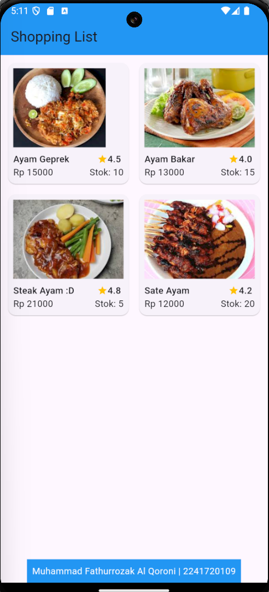
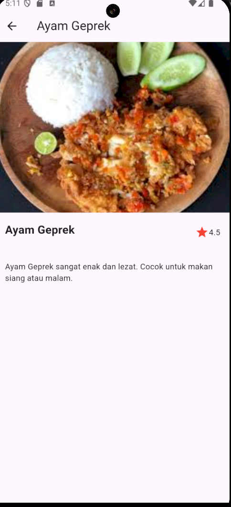

# belanja

A new Flutter project.

## Getting Started

This project is a starting point for a Flutter application.

A few resources to get you started if this is your first Flutter project:

- [Lab: Write your first Flutter app](https://docs.flutter.dev/get-started/codelab)
- [Cookbook: Useful Flutter samples](https://docs.flutter.dev/cookbook)

For help getting started with Flutter development, view the
[online documentation](https://docs.flutter.dev/), which offers tutorials,
samples, guidance on mobile development, and a full API reference.

# Praktikum 2 
## Hasil Tugas Praktikum 2
### Home Page 
Pada home page ini saya menambahkan gambar dan untuk produknya dan merapikan list dari produknya

### Item Page
Setelah salah satu produk ditekan, maka akan menampilkan item page tersebut seperti gambar berikut

