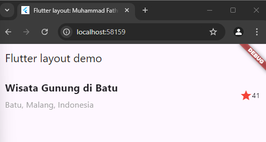
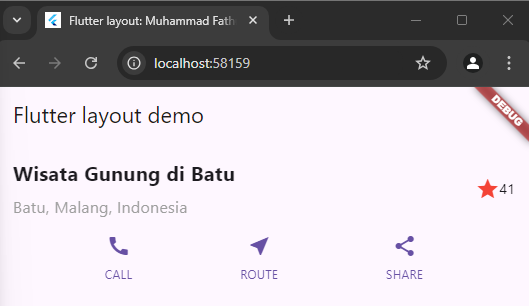
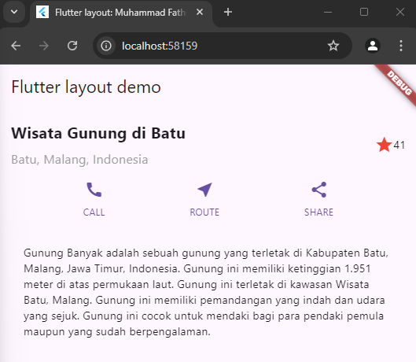
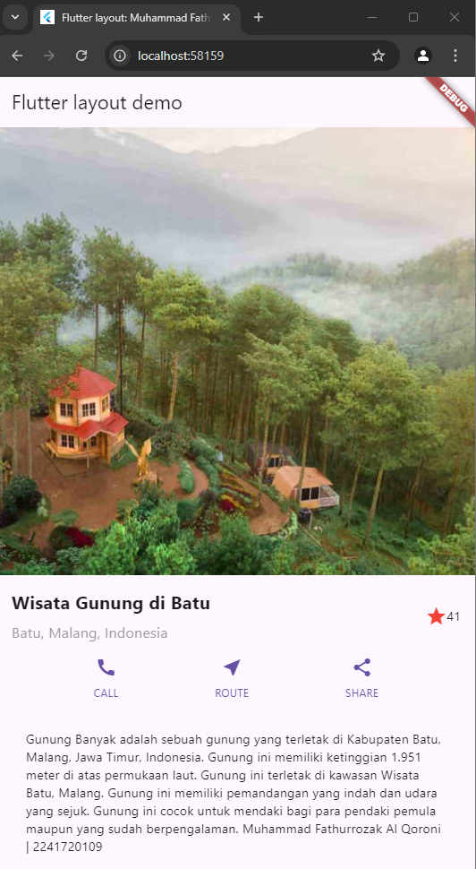

# layout_flutter

A new Flutter project.

## Getting Started

This project is a starting point for a Flutter application.

A few resources to get you started if this is your first Flutter project:

- [Lab: Write your first Flutter app](https://docs.flutter.dev/get-started/codelab)
- [Cookbook: Useful Flutter samples](https://docs.flutter.dev/cookbook)

For help getting started with Flutter development, view the
[online documentation](https://docs.flutter.dev/), which offers tutorials,
samples, guidance on mobile development, and a full API reference.

# Praktikum 1 - Membangun Layout di Flutter
Soal Nomor 1 <br>
Menambahkan CrossAxisAlignment.start untuk penataan tempat elemen-elemen sehingga berada pada sebelah kiri atas
```dart
 child: Column(
              crossAxisAlignment: CrossAxisAlignment.start,
              children: [
```

Menambahkan nilai padding bottom = 8 untuk memberikan jarak pada bagian bawah sebesar 8
```dart
 Container(
                  padding: const EdgeInsets.only(bottom: 8),
                  child: const Text(
                    'Wisata Gunung di Batu',
                    style: TextStyle(
                      fontWeight: FontWeight.bold,
                      fontSize:
                          20, 
                    ),
                  ),
                ),
                const Text(
                  'Batu, Malang, Indonesia',
                  style: TextStyle(
                    color: Colors.grey,
                    fontSize: 16,
                  ),
                ),
              ],
            ),

```
Menambahkan icon star dengan warna merah dan menambahkan teks disampingnya
```dart
const Icon(
            Icons.star,
            color: Colors.red,
          ),
          const Text('41'),
        ],
      ),
    );
```
Mengganti body text 'hello world' dengan memasukkan widget titleSection yang telah dibuat sebelumnya, sehingga text dan icon yang sudah dibuat akan tampil
```dart
return MaterialApp(
      title: 'Flutter layout: Muhammad Fathurrozak Al Qoroni | 2241720109',
      home: Scaffold(
        appBar: AppBar(
          title: const Text('Flutter layout demo'),
        ),
        body: ListView(
          children: [
            // Image.asset(
            //   'images/gunungBanyak.jpg',
            //   width: 600,
            //   height: 500,
            //   fit: BoxFit.cover,
            // ),
            titleSection, // Title Section
            // buttonSection,
            // textSection,
          ],
        ),
      ),
    );
```
Hasil Kode Program <br>
 

# Praktikum 2 - Implementasi Button Row
Membuat method _buildButtonColumn
```dart
  Column _buildButtonColumn(Color color, IconData icon, String label) {
    return Column(
      mainAxisSize: MainAxisSize.min,
      mainAxisAlignment: MainAxisAlignment.center,
      children: [
        Icon(icon, color: color),
        Container(
          margin: const EdgeInsets.only(top: 8.0),
          child: Text(
            label,
            style: TextStyle(
              fontSize: 12.0,
              fontWeight: FontWeight.w400,
              color: color,
            ),
          ),
        ),
      ],
    );
  }
```
Membuat fungsi widget buttonSection yang digunakan untuk memanggil fungsi warna, icon, dan teks, seperti: icon call, near_me untuk lokasi, dan share untuk icon membagikan dengan masing masing teks.
```dart
    Widget buttonSection = Container(
      child: Row(
        mainAxisAlignment: MainAxisAlignment.spaceEvenly,
        children: [
          _buildButtonColumn(color, Icons.call, 'CALL'),
          _buildButtonColumn(color, Icons.near_me, 'ROUTE'),
          _buildButtonColumn(color, Icons.share, 'SHARE'),
        ],
      ),
    );
```
Menambahkan buttonSection ke dalam body sehingga menampilkan seperti fungsi yang sudah dibuat sebelmumnya
```dart
return MaterialApp(
      title: 'Flutter layout: Muhammad Fathurrozak Al Qoroni | 2241720109',
      home: Scaffold(
        appBar: AppBar(
          title: const Text('Flutter layout demo'),
        ),
        body: ListView(
          children: [
            // Image.asset(
            //   'images/gunungBanyak.jpg',
            //   width: 600,
            //   height: 500,
            //   fit: BoxFit.cover,
            // ),
            titleSection,
            buttonSection,
            // textSection,
          ],
        ),
      ),
    );
```
Hasil Kode Progam <br>


# Praktikum 3 - Implementasi Text Section
Membuat widget textSection untuk deskripsi wisata gunung di batu
```dart
Widget textSection = Container(
      padding: const EdgeInsets.all(32),
      child: const Text(
        'Gunung Banyak adalah sebuah gunung yang terletak di Kabupaten Batu, Malang, Jawa Timur, Indonesia. Gunung ini memiliki ketinggian 1.951 meter di atas permukaan laut. Gunung ini terletak di kawasan Wisata Batu, Malang. Gunung ini memiliki pemandangan yang indah dan udara yang sejuk. Gunung ini cocok untuk mendaki bagi para pendaki pemula maupun yang sudah berpengalaman.',
        softWrap: true,
      ),
    );
```
Menambahkan textSection ke dalam body
```dart
return MaterialApp(
      title: 'Flutter layout: Muhammad Fathurrozak Al Qoroni | 2241720109',
      home: Scaffold(
        appBar: AppBar(
          title: const Text('Flutter layout demo'),
        ),
        body: ListView(
          children: [
            // Image.asset(
            //   'images/gunungBanyak.jpg',
            //   width: 600,
            //   height: 500,
            //   fit: BoxFit.cover,
            // ),
            titleSection,
            buttonSection,
            textSection,
          ],
        ),
      ),
    );
```
Hasil Kode Progam <br>


# Praktikum 4 - Implementasi Image Section
Membuat folder images, kemudian memasukkan file image ke folder tersebut, lalu mengatur file pubspec.yaml seperti di bawah ini <br>
```dart
flutter:

  uses-material-design: true
  assets:
  - images/gunungBanyak.jpg
```
Menambahkan asset image ke dalam body
```dart
body: Column(
          children: [
            Image.asset(
              'images/gunungBanyak.jpg',
              width: 600,
              height: 500,
              fit: BoxFit.cover,
            ),
            titleSection,
            buttonSection,
            textSection,
          ],
        ),
```
Mengubah Column menjadi ListView untuk mendukung scroll yang dinamis
```dart
body: ListView( // List view
          children: [
            Image.asset(
              'images/gunungBanyak.jpg',
              width: 600,
              height: 500,
              fit: BoxFit.cover,
            ),
            titleSection,
            buttonSection,
            textSection,
          ],
        ),
```
Hasil Kode Program <br>
