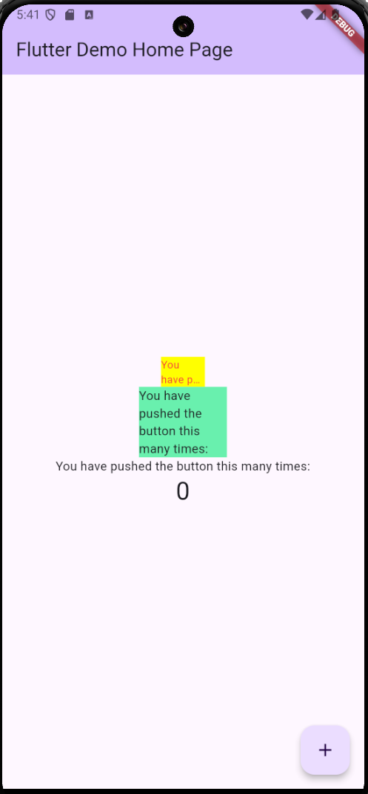
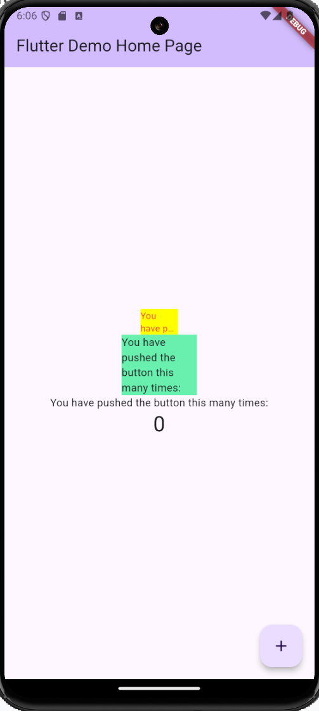

# flutter_plugin_pubdev

A new Flutter project.

## Getting Started

This project is a starting point for a Flutter application.

A few resources to get you started if this is your first Flutter project:

- [Lab: Write your first Flutter app](https://docs.flutter.dev/get-started/codelab)
- [Cookbook: Useful Flutter samples](https://docs.flutter.dev/cookbook)

For help getting started with Flutter development, view the
[online documentation](https://docs.flutter.dev/), which offers tutorials,
samples, guidance on mobile development, and a full API reference.

# Tugas Praktikum
## Hasil Praktikum


## Maksud dari langkah 2
Maksud dari langkah 2 yaitu untuk menambahkan plugin auto_size_text, sehingga pada file pubspec.yaml plugin tersebut akan muncul pada dependencies. Command tersebut mempersingkat untuk menambahkan plugin sehingga tidak perlu masuk ke file pubspec.yaml terlebih dahulu kemudian mengetikkan plugin tersebut di dalam dependencies dan melakukan save.


## Maksud dari langkah 5
1. Variabel text nantinya digunakan untuk menyimpan teks yang akan ditampilkan pada widget
2. Parameter di constructor tersebut maksudnya yaitu ketika menggunakan atau membuat RedtextWidget maka wajib parameter text tersebut diisi kemudian value yang ada pada this.next akan disimpan ke dalam variabel text

## Fungsi dari 2 widget yang berbeda pada langkah 6
Kedua widget yang ada pada langkah ke 6 berfungsi untuk menampilkan teks dengan background yang memiliki warna dan lebar masing-masing.

1. Widget dibawah ini menampilkan background kuning dengan lebar 50 dan teks yang ada di dalamnya menggunakan RexTextWidget yang memiliki warna merah sesuai dengan widget yang sudah dibuat pada file red_text_widget 
```dart
Container(
   color: Colors.yellowAccent,
   width: 50,
   child: const RedTextWidget(
             text: 'You have pushed the button this many times:',
          ),
),
```
2. Widget di bawah ini menampilkan background hijau dengan lebar 100 dan teks yang ada di dalamnya menggunakan Text Widget yang defaultnya memiliki warna hitam.
```dart
Container(
    color: Colors.greenAccent,
    width: 100,
    child: const Text(
           'You have pushed the button this many times:',
          ),
),
```
## Maksud dari tiap parameter yang ada di plugin auto_size_text
1. text: berisi teks yang akan ditampilkan 
2. style: berisi style dari teks yang nantinya akan ditampilkan seperti warna merah untuk pewarnaan teks dan ukuran font dari tekst tersebut
3. maxLines: berisi maksimal baris dari teks yang nantinya akan ditampilkan. Contohnya pada kode program yang sesuai dengan modul tersebut maxLines memiliki nilai 2, sehingga teks yang ada di dalam kontainer tersebut maksimal akan ditampilkan dua baris

## Hasil Kode Program

